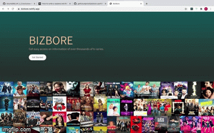

# BIZBORE: Using React + Redux 

Bizbore is a web application where you can get information on thousands of TV shows. 

You may visit the site: 
[Bizbore](https://bizbore.netlify.app/)

## Setup:
1. Fork and Clone this repo
2. cd into the project folder with `cd LAP_2_CONCLUSION-BIZBORE`
3. Install packages with `npm install`
4. Start the app with `npm start`
5. This is automatically take you to `localhost:8000`

